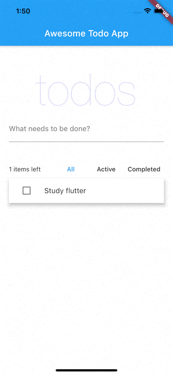

[](https://pub.dev/packages/riverpod)&ensp; [](https://pub.dev/packages/riverpod)&ensp; [](https://pub.dev/packages/freezed)&ensp; [](https://pub.dev/packages/hive)&ensp; [](https://dart.dev/)   

# Todo App

## Packages
[](https://docs.hivedb.dev/#/)&ensp;[Hive](https://pub.dev/packages/hive "Hive documents")&ensp;  [](https://riverpod.dev/)&ensp;[Riverpod](https://pub.dev/packages/riverpod "Riverpod documents")&ensp; [state_notifier](https://pub.dev/packages/state_notifier "state_notifier documents")&ensp; [freezed](https://pub.dev/packages/freezed "freezed documents")
## Preview


## ⚙️ Requirement
* Dart 2.12.2

## 🚀 Getting start
After clone, at once exec build_runner.

```
flutter pub run build_runner build --delete-conflicting-outputs
```


## Reference
**hive**  
https://docs.hivedb.dev/#/  
https://qiita.com/kasa_le/items/f39d759741c736f1d600  
https://matsumarudesu.com/flutter-hive-begginerdescription/  

**riverpod**  
https://zenn.dev/riscait/books/flutter-riverpod-practical-introduction/viewer/migrate-to-v1

**hive + freezed**  
https://github.com/hivedb/hive/issues/225

### ⚡&ensp;Social Media


[](https://twitter.com/intent/follow?original_referer=https%3A%2F%2Fgithub.com%2Fmonkeydaichan&screen_name=monkeydaichan)&ensp;Twitter: [@Daichi Yasuda](https://twitter.com/intent/follow?original_referer=https%3A%2F%2Fgithub.com%2Fmonkeydaichan&screen_name=monkeydaichan "Twitter monkeydaichan")

[](https://www.instagram.com/daichigorilla/)&ensp;Instagram: [@Daichi Yasuda](https://www.instagram.com/daichigorilla/ "Instagram monkeydaichan")

[](https://www.facebook.com/daichi.yasuda.77)&ensp;Facebook: [@Daichi Yasuda](https://www.facebook.com/daichi.yasuda.77 "Facebook monkeydaichan")


[](https://github.com/monkeydaichan)&ensp;GitHub: [@Daichi Yasuda](https://github.com/monkeydaichan "GitHub monkeydaichan")

<!-- [](https://medium.com/@DaichiYasuda)&ensp;Medium: [@DaichiYasuda](https://medium.com/@DaichiYasuda "Medium monkeydaichan") -->

<!-- [](https://DaichiYasuda.com)&ensp;Website: [@DaichiYasuda](https://DaichiYasuda.com "Website monkeydaichan") -->


